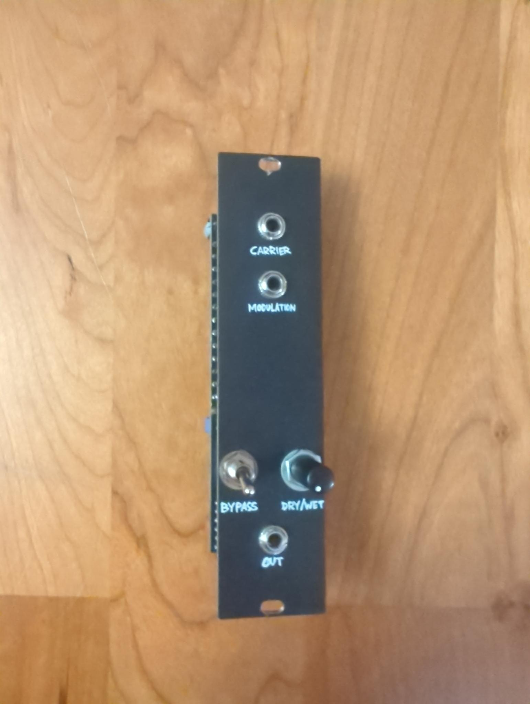
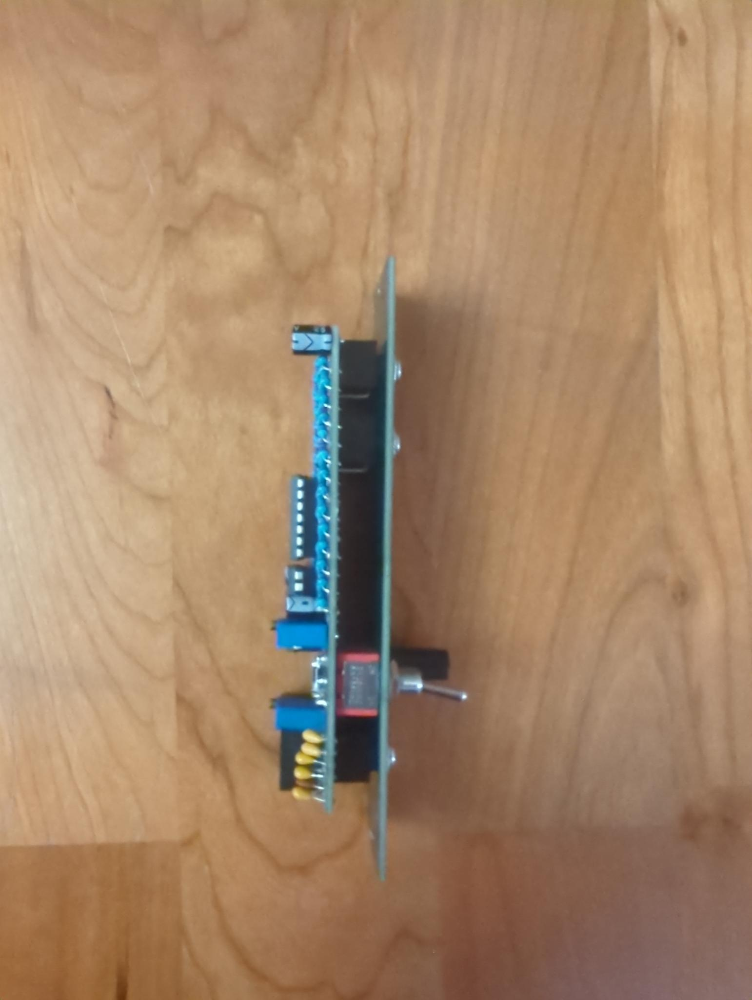
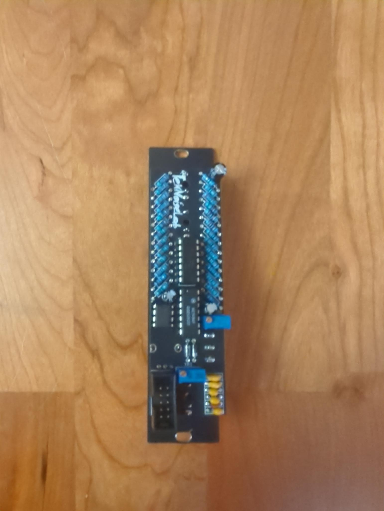

# Ringmodulator
A simple ring modulator inspired by [this](https://www.haraldswerk.de/Wave_Processors/Ringmodulator/Dual_Ringmod.html) circuit. I added a switch and a DRY/WET control to make it more versatile.

## Build
- Order the PCBs from the PCB manufacturer of your choice.
- Order the components from your favorite electronics supplier.
- Solder the components to the PCB.
- Mount the panel.
- Calibrate the circuit [described here](https://www.haraldswerk.de/Wave_Processors/Ringmodulator/Dual_Ringmod.html).

